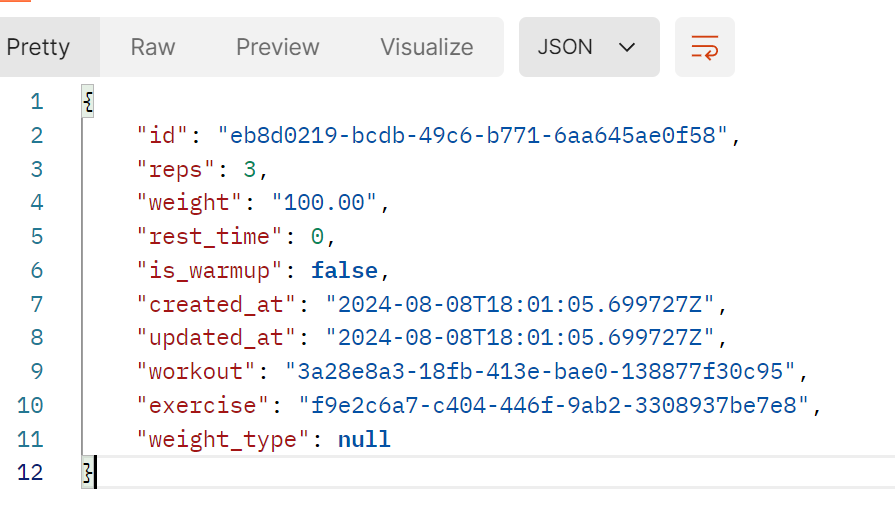
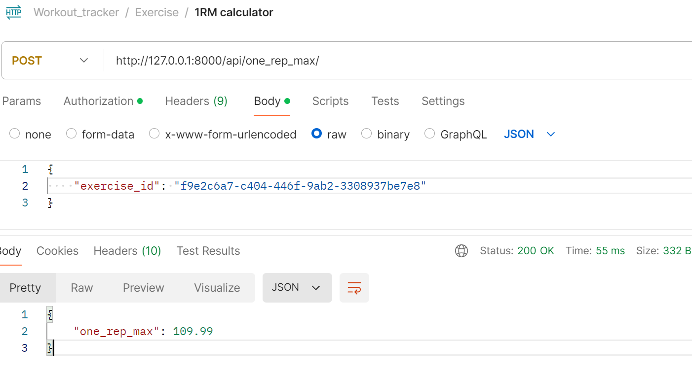

# API for workout tracking

To run the server, please execute the following from the root directory:
go inside the workout (server) directory

install django and djangorestframework 
```
pip install django djangorestframework psycopg2-binary djangorestframework-simplejwt openai
```

make migrations and run
```
python manage.py makemigrations
python manage.py migrate
```

run the server
```
python manage.py runserver
```

Note: You might have to install some other package as needed.

You will have to create database for postgres with name "workoutdb" 

One of our feature is the ability to calculate 1RM.  If you can do 100 weight for 3 reps then your exercise set is input as:


Now if you calculate 1RM using our algorithm, it estimates the 1RM to be :


